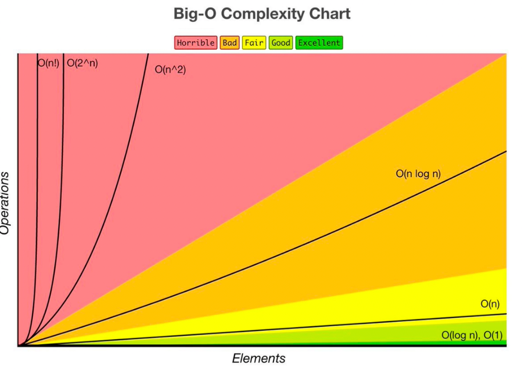
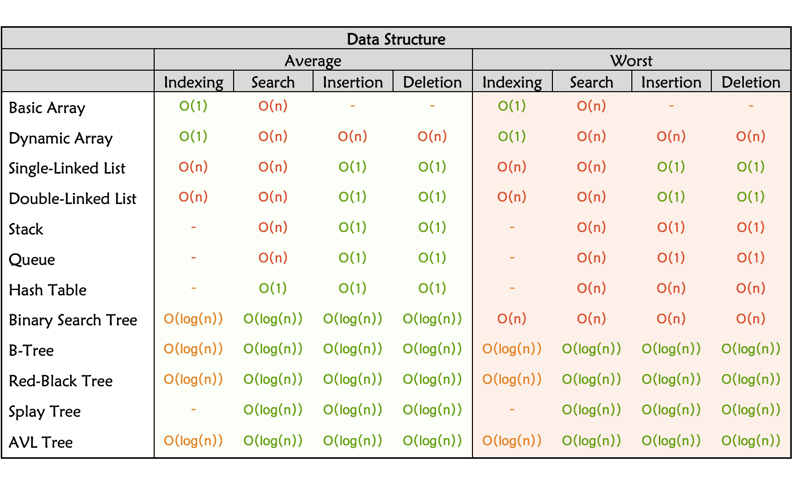
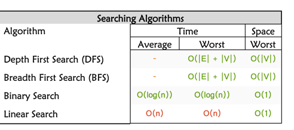
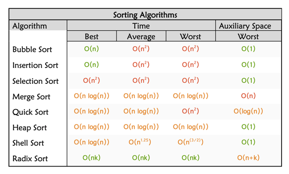

# Data Structures and Algorithms
Data structures + Algorithms = Programs

## Data Structure 
- Array
- Graphs
- Hash table
- Linked List
- Stack 
- Tree
- Queue
- Set

## Algorithms
- Sorting
- Dynamic Programming
- BFS + DFS(Search)
- Recursion

## Big-O complexity Chart

