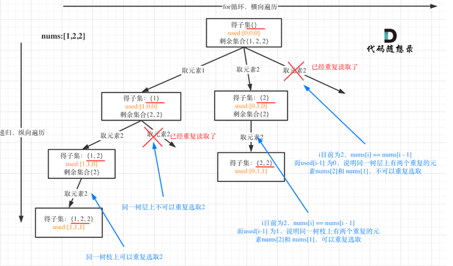

# backtracking

常被用于搜索排列组合问题的所有可能性, 不同于普通的暴力搜索，回溯法会在每一步判断状态是否合法 而不是等到状态全部生成后再进行确定, 当某一步状态非法时 它将退到上一步中正确的位置 然后继续搜索。

## 什么时候需要`startIndex`?
每次从集合中选取元素，可选择的范围随着选择的进行而收缩，调整可选择的范围，就是要靠startIndex. 需要startIndex来记录下一层递归，搜索的起始位置


## 树层去重

```python
class Solution:
    def subsetsWithDup(self, nums: List[int]) -> List[List[int]]:
        '''
        - 原数组有重复 所以同一树层要去重
        - 回溯时需要从下一位取 所以需要startIndex 但同一树枝可以取val相同的树
        - 无需剪枝
        '''
        res = []
        nums.sort()
        # 用来记录同一树枝上的元素是否使用过
        used = [0] * len(nums)

        def backtrack(startIndex, path):
            res.append(path[:])
            # 这里为什么不能return
            # 有return 直接 return [[]]
            for i in range(startIndex, len(nums)):
                if used[i] == 0:
                    # 说明同一树层上有两个重复的元素，不可以重复选取
                    if i > 0 and nums[i] == nums[i - 1] and used[i - 1] == 0:
                        continue
                    used[i] = 1
                    path.append(nums[i])
                    backtrack(i + 1, path)
                    path.pop()
                    used[i] = 0

        backtrack(0, [])
        return res
```
##剪枝
